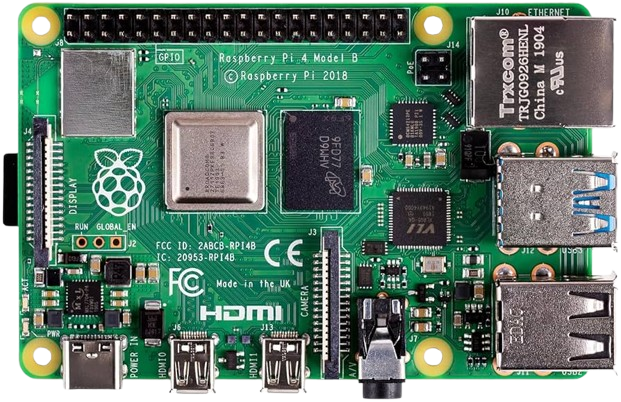

# PlateVision

  

  <h3 align="center">IoT and Edge AI Based Smart Vehicle Gate Entry System</h3>

  

    Raspberry Pi based Indian vehicle number plate recognition and smart gate entry logging system using OpenCV, EasyOCR, and Python
     
    <strong>IoT · Edge AI · Computer Vision · Smart Automation</strong>
      
    <a href="https://github.com/rachitsrivastava2114/PlateVision/issues">Report Bug</a>
    ·
    <a href="https://github.com/rachitsrivastava2114/PlateVision">View Project</a>
  

---

## Table of Contents

- [Project Overview](#project-overview)
  - [Objectives](#objectives)
  - [Key Features](#key-features)
  - [System Architecture](#system-architecture)
- [Hardware Components Used](#hardware-components-used)
- [Software \& Tools](#software--tools)
- [Pin Configuration](#pin-configuration)
- [Command Mapping](#command-mapping)
- [Working Principle](#working-principle)
- [Software Flow](#software-flow)
- [Project Visualization](#project-visualization)
- [Results](#results)
- [Applications](#applications)
- [Future Improvements](#future-improvements)
- [Author](#author)
- [License](#license)

---

## Project Overview

**Plate Vision** is a Raspberry Pi based **IoT and Edge AI smart vehicle gate entry system** designed for automatic Indian vehicle number plate recognition. The system uses a camera to capture the vehicle number plate, processes the image locally using **OpenCV**, extracts the plate text using **EasyOCR**, validates the detected number using an Indian number plate format, and logs the vehicle entry details into an Excel file.

The system also captures the vehicle image and simulates automatic gate opening after successful plate recognition.

This project demonstrates practical concepts of:

- IoT based smart gate automation
- Edge AI processing on Raspberry Pi
- Computer vision using OpenCV
- Optical Character Recognition using EasyOCR
- Excel based vehicle entry logging
- Real-time camera interfacing
- Smart parking and access control

---

## Objectives

- Design a Raspberry Pi based smart vehicle entry system
- Detect Indian vehicle number plates from a live camera feed
- Perform OCR locally on the Raspberry Pi without cloud dependency
- Validate number plates using Indian registration format
- Log vehicle plate number, date, time, and image name
- Capture vehicle images automatically
- Simulate or control gate opening after successful recognition
- Build a practical IoT and Edge AI based automation prototype

---

## Key Features

- 🚗 Indian vehicle number plate recognition
- 📷 Real-time camera input using OpenCV
- 🧠 Edge AI processing on Raspberry Pi
- 🔍 OCR using EasyOCR
- 📝 Excel based vehicle entry logging
- 🖼️ Automatic vehicle image capture
- 🚧 Smart gate open/close simulation
- ⏱️ Duplicate entry prevention
- 🇮🇳 Indian number plate format validation
- 💻 Lightweight Python implementation
- 🔌 Can be extended with relay or servo motor control
- 📊 FPS display on live camera feed

---

## System Architecture

The system is centered around the **Raspberry Pi**, which acts as the main processing unit. A USB camera or Pi Camera captures the vehicle number plate. The captured frame is processed using OpenCV, and OCR is performed using EasyOCR.

Once a valid number plate is detected, the system saves the entry details into an Excel file and stores the vehicle image in the captured images folder. The gate opening operation is then triggered either virtually or through GPIO-based relay control.

  

---

## Hardware Components Used

- **Raspberry Pi 4 / Raspberry Pi 5**
- **USB Camera / Pi Camera**
- **Power Supply**
- **Memory Card**
- **Monitor / SSH Access**

---

## Software & Tools

- **Python 3**
- **OpenCV** – for camera handling and image processing
- **EasyOCR** – for number plate text recognition
- **OpenPyXL** – for Excel file logging
- **Regular Expressions** – for Indian plate format validation
- **Raspberry Pi OS**

---

