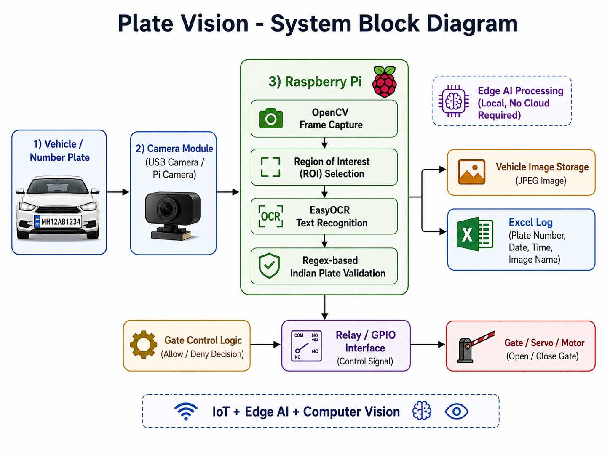
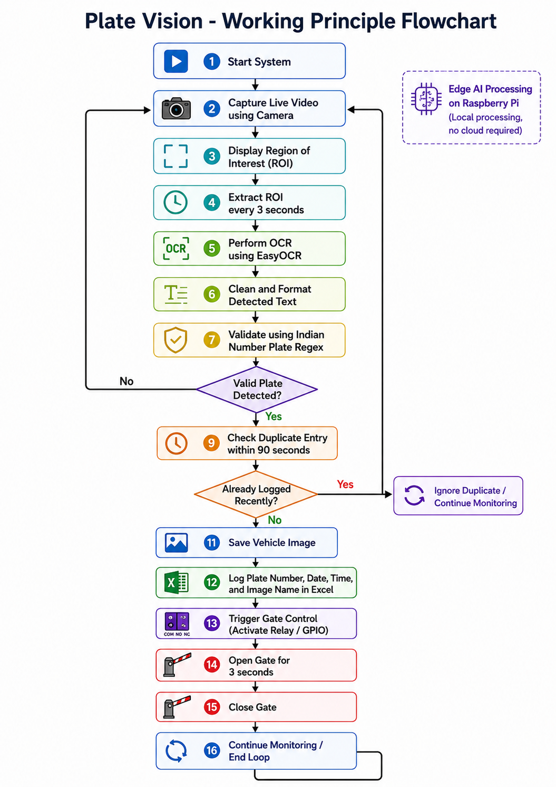
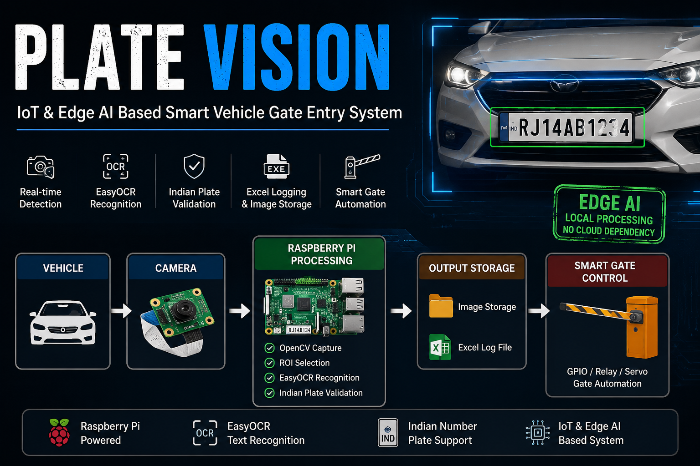

# PlateVision

  

  <h3 align="center">IoT and Edge AI Based Smart Vehicle Gate Entry System</h3>

  

    Raspberry Pi based Indian vehicle number plate recognition and smart gate entry logging system using OpenCV, EasyOCR, and Python
     
    <strong>IoT · Edge AI · Computer Vision · Smart Automation</strong>
      
    <a href="https://github.com/rachitsrivastava2114/PlateVision/issues">Report Bug</a>
    ·
    <a href="https://github.com/rachitsrivastava2114/PlateVision">View Project</a>
  

## Table of Contents

- [Project Overview](#project-overview)
  - [Objectives](#objectives)
  - [Key Features](#key-features)
  - [System Architecture](#system-architecture)
- [Hardware Components Used](#hardware-components-used)
- [Software \& Tools](#software--tools)
- [Working Principle](#working-principle)
- [Project Visualization](#project-visualization)
- [Results](#results)
- [Applications](#applications)
- [Author](#author)

## Project Overview

**Plate Vision** is a Raspberry Pi based **IoT and Edge AI smart vehicle gate entry system** designed for automatic Indian vehicle number plate recognition. The system uses a camera to capture the vehicle number plate, processes the image locally using **OpenCV**, extracts the plate text using **EasyOCR**, validates the detected number using an Indian number plate format, and logs the vehicle entry details into an Excel file.

The system also captures the vehicle image and simulates automatic gate opening after successful plate recognition.

This project demonstrates practical concepts of:

- IoT based smart gate automation
- Edge AI processing on Raspberry Pi
- Computer vision using OpenCV
- Optical Character Recognition using EasyOCR
- Excel based vehicle entry logging
- Real-time camera interfacing
- Smart parking and access control

## Objectives

- Design a Raspberry Pi based smart vehicle entry system
- Detect Indian vehicle number plates from a live camera feed
- Perform OCR locally on the Raspberry Pi without cloud dependency
- Validate number plates using Indian registration format
- Log vehicle plate number, date, time, and image name
- Capture vehicle images automatically
- Simulate or control gate opening after successful recognition
- Build a practical IoT and Edge AI based automation prototype

## Key Features

- 🚗 Indian vehicle number plate recognition
- 📷 Real-time camera input using OpenCV
- 🧠 Edge AI processing on Raspberry Pi
- 🔍 OCR using EasyOCR
- 📝 Excel based vehicle entry logging
- 🖼️ Automatic vehicle image capture
- 🚧 Smart gate open/close simulation
- ⏱️ Duplicate entry prevention
- 🇮🇳 Indian number plate format validation
- 💻 Lightweight Python implementation
- 🔌 Can be extended with relay or servo motor control
- 📊 FPS display on live camera feed

## System Architecture

The system is centered around the **Raspberry Pi**, which acts as the main processing unit. A USB camera or Pi Camera captures the vehicle number plate. The captured frame is processed using OpenCV, and OCR is performed using EasyOCR.

Once a valid number plate is detected, the system saves the entry details into an Excel file and stores the vehicle image in the captured images folder. The gate opening operation is then triggered either virtually or through GPIO-based relay control.

  

## Hardware Components Used

- **Raspberry Pi 4 / Raspberry Pi 5**
- **USB Camera / Pi Camera**
- **Power Supply**
- **Memory Card**
- **Monitor / SSH Access**

## Software & Tools

- **Python 3**
- **OpenCV** – for camera handling and image processing
- **EasyOCR** – for number plate text recognition
- **OpenPyXL** – for Excel file logging
- **Regular Expressions** – for Indian plate format validation
- **Raspberry Pi OS**

## Working Principle

Plate Vision works by capturing the vehicle number plate through a camera connected to the Raspberry Pi and processing the image locally using OpenCV and EasyOCR. The complete recognition and logging process is performed on the Raspberry Pi itself, making the system an Edge AI based IoT application.

- The Raspberry Pi starts the live camera feed using OpenCV.
- A fixed Region of Interest is shown on the screen where the vehicle number plate should be placed.
- After a fixed time interval, the system captures only the selected ROI instead of processing the complete frame.
- The selected plate region is passed to EasyOCR for text recognition.
- The detected text is cleaned by removing spaces, hyphens, and unwanted characters.
- The cleaned text is converted into uppercase format.
- The system checks whether the detected text matches the Indian vehicle number plate format.
- If a valid plate number is detected, the system saves:
  - Vehicle plate number
  - Date
  - Time
  - Captured vehicle image name
- The details are stored in an Excel file named vehicle_log.xlsx.
- The captured vehicle image is saved inside the captured_vehicles folder.
- After successful detection, the gate opening function is triggered.
- The gate remains open for a fixed duration and then closes automatically.
- To avoid repeated entries, the same vehicle number is not saved again within 90 seconds.

  

## Project Visualization

To understand how the data flows, try the live interactive simulator:

👉 **[Launch the Plate Vision Simulator](https://rachitsrivastava2114.github.io/PlateVision/)**

## Results

The **Plate Vision** system was successfully implemented and tested on Raspberry Pi as an IoT and Edge AI based smart vehicle gate entry prototype. The system captures the vehicle number plate through the camera, processes the image locally, recognizes the plate number using EasyOCR, validates the detected text, logs the vehicle entry, and triggers the gate opening action.

- The Raspberry Pi successfully captured real-time video using the connected camera.
- The Region of Interest was displayed properly for placing the vehicle number plate.
- EasyOCR detected and extracted text from the selected plate region.
- The detected text was cleaned and validated using the Indian number plate format.
- Valid plate numbers were stored in the Excel log file with date, time, and image name.
- Captured vehicle images were saved automatically.
- Duplicate entries of the same vehicle were prevented for 90 seconds.
- The gate opening and closing operation was successfully simulated.
- The project demonstrated local Edge AI processing without cloud dependency.

---

## Video Demonstration

  

  <b>Figure: Plate Vision Working Video Demonstration</b>

  <a href="videos/demo.mp4"><b>▶ Watch Demo Video</b></a>

## Applications

**Plate Vision** can be used in real-world smart automation and security systems where vehicle entry needs to be monitored and recorded automatically.

- **Smart Parking Systems** – Automatic vehicle entry logging for parking areas.
- **College and University Gates** – Vehicle monitoring for students, faculty, and staff.
- **Apartment and Society Security** – Entry record maintenance for residents and visitors.
- **Office Campus Access Control** – Automated logging of employee and visitor vehicles.
- **Toll Booth Automation** – Number plate based vehicle identification.
- **Residential Gate Automation** – Smart gate opening for authorized vehicles.
- **IoT Security Projects** – Practical example of camera, Raspberry Pi, and automation integration.
- **Edge AI Demonstration** – Shows local AI processing without depending on cloud servers.
- **Vehicle Monitoring System** – Maintains date, time, plate number, and image-based vehicle records.

## Author

**Rachit Srivastava** 
**Nakshtra Agarwal** 
**Shiviansh Yadav** 
Bachelor of Technology – Electronics and Communication Engineering

